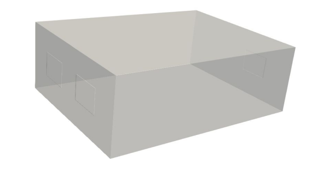
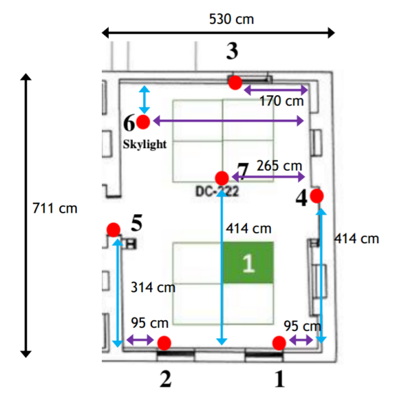

<!-- PROJECT LOGO -->
<br />
<p align="center">
  <a href="https://github.com/acse-2020/">
    
  </a>
  
  <h3 align="center">Final project</h3>
  <p align="center">
    
  </p>
</p>

## Data assimilation using Generative Adversarial Networks to determine COVID-19 infection risks in enclosed spaces using autoencoders for compression
[](LICENSE.txt)

<details open="open">
  <summary>Table of Contents</summary>
  <ol>
    <li>
      <a href="#project-description">Project Description</a>
    </li>
    <li>
      <a href="#getting-started">Getting Started</a>
      <ul>
        <li><a href="#Google-shared-link">Google shared links and Download</a></li>
      </ul>
    </li>
    <li><a href="#Colab-Notebooks">Colab Notebooks</a>
      <ul>
        <li><a href="#PredGAN">PredGAN</a></li>
        <li> <a href="#DA-PredGAN">DA-PredGAN</a></li>
         <li><a href="#Compression-and-training">SVD-AE, PCA, NMF with GAN training</a>        
          <li><a href="#SFC-CAE">SFC-CAE</a></li>
          <li><a href="#tT-SNE-visualisation-of-latent-variables">T-SNE visualisation of latent variables</a></li>
            </ul>
        </li>
      </ul>   
    </li>
    <li><a href="#Usage-of-code">Usage of code</a></li>
    <li><a href="#License">License</a></li>
    <li><a href="#Testing">Testing</a></li>
    <li><a href="#Contact">Contact</a></li>
    <li><a href="#Acknowledgements">Acknowledgements</a></li>
  </ol>
</details>


## Project Description

This project is to construct a reduced order  model  of  the  flow  inside  a  room  using  various  compression  methods  for  the  dimensionality reduction  and  a  GAN  for  the  prediction. Then  assimilated  some  data  collected  at  sensors from experiment with the DA-PredGAN algorithm.

To know what GAN is, here is the paper of [GAN](https://arxiv.org/abs/1406.2661). Our project is built based on the work, [DC-GAN](https://arxiv.org/abs/1511.06434), [DA-PredGAN](https://arxiv.org/abs/2105.07729), [SFC-CAE](https://arxiv.org/abs/2011.14820) and [SVD-AE](https://arxiv.org/abs/2008.10532).

## Know about where our data has been collected

<br />
<p float="center">
  
   
</p>
The room where the experimental data had been collected is located in the Clarence Centre (belonging to London South Bank University) and has 3 windows, two on one side with 1 on the other facing the road in London. Levels of CO2 were collected by seven sensors located at different optimised positions within the [room](https://link.springer.com/article/10.21136/AM.2021.0307-19). Provided by Laetitia Mottet, the given simulation data set consists of 455 (time series) vtu files.

## Getting started
### Dependencies

* Python >= 3.5
* torch >= 1.8.0
* Tensorflow >= 2.0
* numpy >= 1.19.5
* h5py ~= 3.4.0
* matplotlib ~= 3.2.2
* vtk >= 9.0
* livelossplot ~= 0.5.4
* meshio[all]
* cmocean ~= 2.0
* progressbar2 ~= 3.38.0
* (Optional) GPU/multi GPUs with CUDA

## Colab Notebooks

The code are mainly put in the src files.

### [Compression and training](https://github.com/acse-2020/acse2020-acse9-finalreport-acse-yl2020/blob/0abb114cc99243e7ef43f4354fac999c199f39f5/src/Compressions%20and%20training/Compression_and_training.ipynb):  extract data from vtu files and proposed dimensionality reduction approaches on dataset, then train the GAN based on the latent variables from different methods. 

### [PredGAN](src/PredGAN/PredGAN.ipynb):  train an GAN network to predict and assimilate data.

### [DA-PredGAN](src/DA-PredGAN/DA_PredGAN_enhanced.ipynb):  implement DA-PredGAN algorithm.

### [SFC-CAE](src/SFC-CAE/SFC_CAE_Compression.ipynb):  implement SFC-CAE approach for dimensionality reduction, including .py files for the models and Fortran code for SFCs.

### [T-SNE visualisation of latent variables](t_SNE_visualisation.ipynb):  visualise non-linear connections in latent variables extracted from different dimensionality reduction methods.


## Google shared link

As the pkl files e.g. autoencoder_py_43.pkl (latent representations from SFC-CAE is over 100M GitHub upload limitation), we shared the Google drive for you if you want to download: [model link](https://drive.google.com/drive/folders/1o7u_-hJpF6gLP1jXYB3ZlVBcwmrvfBpt?usp=sharing).

While the most of the pkl files used to scale, store the data are over limitations, here we shared the link in case want to have a look: [large files](https://drive.google.com/drive/folders/19xJlN0VifwOlvj-y9aungSZKTPPyv4J7?usp=sharing). The link includes the latent variables (43 and 16), GAN model generator...

The ClarenceCentre data could either be obtained by Wget command provided in the [Compression_and_training](src/Compressions and training/Compression_and_training.ipynb) or the link of [google drive](https://drive.google.com/drive/folders/1ckjONW4EyLBkWUcJE7JqG-RZDz376X4G?usp=sharing).

### Download

1. Clone the repository:
```sh
$ git clone https://github.com/acse-yl2020/acse-9-independent-research-project-yl2020
```
2. Upload to the Google drive using Colab to open the ipynb files.

## Usage of code

This project was carried out and built under Google Colab with Python 3.5 for its superior visualisation and I/O processing. You could also execute in jupyter notebook by setting the paths and importing libraies correctly (following Dependencies). In order to execute the functions in vtktools including read and write vtu files etc,

```sh
pip install vtk
```

If you want to use on google drive, then

```sh
from google.colab import drive
drive.mount('/content/gdrive')
```
and please change your dir once you are in different folder:

```sh
os.chdir('/content/gdrive/MyDrive/dimension reduction')
```

Assuming your dir is called 'I love ACSE', change to dir above to:

```sh
os.chdir('/content/gdrive/MyDrive/I love ACSE')
```

In the .ipynb files, the models like encoder, generator and scaler etc. are saved in .pkl files and stored in different files e.g. /output_files, if you want to import these models, e.g. scaler_std for scaling the data, and assuming your folder of saving it is 'I_love_saving', then change:

```sh
scaler_std = joblib.load('output_files/scaler_std_full.pkl')
```
to

```sh
scaler_std = joblib.load('I_love_saving/scaler_std_full.pkl')
```

Our code is built by using GPU acceleration from Google Colab. ' Set change run time type ' to  GPU Acceleration and high-RAM usage under the toolbox ' Runtime ' which could speed up the computations. Otherwise, the code on acceleration will not work and may raise run-time error.

Due to the limitations of upload large files, the gifs of reconstruction to physical space in ParaView could be created by 'Create_Gif.ipynb' in src. 

## License

Under the Apache 2.0 License.

## Testing 
Some simple and basic tests for the module are avaliable in the .ipynb files.

## Contact
* Yushen Lin yl2020@imperial.ac.uk

## Acknowledgements
Would like to thanks my supervisors for the patient guides:
* Dr. Claire Heaney
* Prof. Christopher Pain 
* Dr. Laetitia Mottet

It was been a pleasure to work and be friends with group members Sanjana, Jamesson and Danhui.
